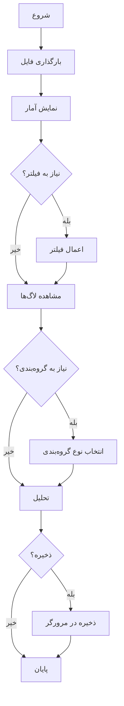

# 📂 ساختار پروژه

```
log-analyzer/
│
├── 📄 index.html              # صفحه اصلی برنامه (نقطه ورود)
│
├── 📁 assets/                 # فایل‌های استاتیک
│   ├── 📁 css/
│   │   └── style.css         # استایل‌های CSS (طراحی رسپانسیو)
│   │
│   └── 📁 js/
│       └── app.js            # منطق JavaScript (تمام عملیات)
│
├── 📚 README.md              # مستندات کامل پروژه
├── 📚 DEPLOYMENT.md          # راهنمای استقرار در GitHub Pages
├── 📚 QUICKSTART.md          # راهنمای سریع استفاده
├── 📚 FEATURES.md            # لیست کامل امکانات
├── 📚 PROJECT-SUMMARY.md     # خلاصه پروژه
│
├── 📋 sample-log.txt         # نمونه لاگ متنی (برای تست)
├── 📋 sample-log.json        # نمونه لاگ JSON (برای تست)
│
└── ⚙️  .gitignore             # تنظیمات Git
```

---

## 🎯 فایل‌های کلیدی

### 1. index.html
```
✓ ساختار HTML5 Semantic
✓ لینک به فونت Vazirmatn
✓ لینک به فایل‌های CSS و JS
✓ تمام عناصر UI
✓ بهینه‌سازی برای SEO
```

### 2. assets/css/style.css
```
✓ طراحی مدرن با Gradient
✓ رسپانسیو (Mobile First)
✓ تم تیره برای نمایش لاگ
✓ انیمیشن‌ها و Transitions
✓ RTL Support
✓ Print Styles
```

### 3. assets/js/app.js
```
✓ مدیریت بارگذاری فایل
✓ Parse و تحلیل لاگ‌ها
✓ جستجو و فیلتر
✓ Regex Engine
✓ گروه‌بندی
✓ IndexedDB Management
✓ Export به JSON
✓ UI Updates
```

---

## 📖 مستندات

### 📚 README.md
- معرفی پروژه
- ویژگی‌های کامل
- نحوه استفاده
- راهنمای فیلتر و جستجو
- FAQ و عیب‌یابی

### 📚 DEPLOYMENT.md
- راهنمای گام به گام استقرار
- روش استفاده از Git
- روش استفاده از GitHub UI
- تنظیمات GitHub Pages
- دامنه سفارشی

### 📚 QUICKSTART.md
- شروع سریع در 7 گام
- مثال‌های عملی
- الگوهای معمول Regex
- نکات کاربردی
- عیب‌یابی سریع

### 📚 FEATURES.md
- لیست کامل امکانات
- تفکیک بر اساس دسته
- جزئیات هر ویژگی
- آمار پروژه

### 📚 PROJECT-SUMMARY.md
- خلاصه کامل پروژه
- محتویات فایل‌ها
- تکنولوژی‌ها
- آمار کد
- چک‌لیست

---

## 🧪 فایل‌های تست

### 📋 sample-log.txt
```
42 خط لاگ متنی
21 INFO
7 WARN
6 ERROR
8 DEBUG
```

### 📋 sample-log.json
```
12 آبجکت JSON
ساختار کامل با metadata
انواع مختلف لاگ
داده‌های تو در تو
```

---

## 🎨 نمای کلی

```
┌─────────────────────────────────────────┐
│         تحلیلگر لاگ محلی               │
│  Local Log Analyzer                     │
├─────────────────────────────────────────┤
│                                         │
│  📤 بارگذاری فایل (TXT/JSON/LOG)       │
│                                         │
│  📊 نمایش آمار                          │
│  ├─ کل خطوط                            │
│  ├─ خطاها                              │
│  ├─ هشدارها                            │
│  └─ اطلاعات                            │
│                                         │
│  🔍 جستجو و فیلتر                      │
│  ├─ جستجوی متنی                        │
│  ├─ فیلتر سطح                          │
│  └─ جستجوی Regex                       │
│                                         │
│  📁 گروه‌بندی                           │
│  ├─ بر اساس سطح                        │
│  ├─ بر اساس تاریخ                      │
│  └─ بر اساس منبع                       │
│                                         │
│  🖥  نمایش لاگ                          │
│  ├─ Syntax Highlighting                │
│  ├─ تم تیره                            │
│  └─ Wrap/No-wrap                       │
│                                         │
│  💾 ذخیره و خروجی                      │
│  ├─ ذخیره در مرورگر                    │
│  ├─ بارگذاری تحلیل‌ها                  │
│  └─ خروجی JSON                         │
│                                         │
└─────────────────────────────────────────┘
```

---

## 🚀 شروع سریع

### روش 1: استفاده محلی
```bash
1. فایل index.html را در مرورگر باز کنید
2. فایل لاگ را بارگذاری کنید
3. شروع به تحلیل کنید!
```

### روش 2: GitHub Pages
```bash
1. Repository جدید در GitHub بسازید
2. فایل‌ها را آپلود کنید
3. GitHub Pages را فعال کنید
4. از آدرس https://username.github.io/repo-name استفاده کنید
```

---

## 🎯 ویژگی‌های برجسته

```
✅ کاملاً محلی (بدون سرور)
✅ حریم خصوصی کامل
✅ رسپانسیو (موبایل، تبلت، دسکتاپ)
✅ فونت و زبان فارسی
✅ Regex پیشرفته
✅ گروه‌بندی هوشمند
✅ ذخیره‌سازی در IndexedDB
✅ خروجی JSON
✅ Syntax Highlighting
✅ بدون وابستگی
```

---

## 📊 آمار پروژه

```
📁 فایل‌ها:       9 فایل
💻 خطوط کد:       ~1,470 خط
📦 حجم:           ~37 KB
🎨 صفحات CSS:     1 فایل
⚙️  اسکریپت‌ها:    1 فایل
📚 مستندات:       5 فایل
🧪 نمونه‌ها:       2 فایل
```

---

## 🔗 لینک‌های مهم

### در پروژه
- [README.md](README.md) - راهنمای کامل
- [QUICKSTART.md](QUICKSTART.md) - شروع سریع
- [DEPLOYMENT.md](DEPLOYMENT.md) - راهنمای استقرار
- [FEATURES.md](FEATURES.md) - لیست امکانات

### منابع خارجی
- [GitHub Pages](https://pages.github.com/)
- [Vazirmatn Font](https://github.com/rastikerdar/vazirmatn)
- [Regex Tutorial](https://regexone.com/)
- [IndexedDB Guide](https://developer.mozilla.org/en-US/docs/Web/API/IndexedDB_API)

---

## ✨ نقشه راه استفاده



---

## 🏁 آماده استفاده!

پروژه کاملاً آماده است:
- ✅ کد بدون خطا
- ✅ مستندسازی کامل
- ✅ فایل‌های تست
- ✅ راهنماهای جامع
- ✅ آماده استقرار

---

**موفق باشید! 🎉**

برای اطلاعات بیشتر، فایل‌های مستندات را مطالعه کنید.

